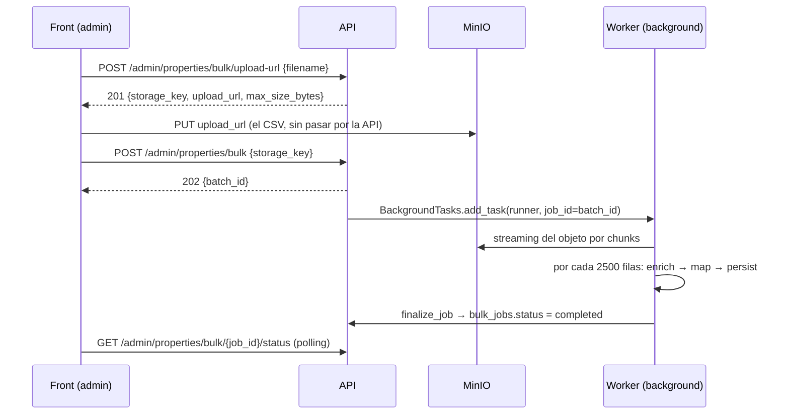

## TL;DR

`BulkCreatePropertiesWorker` (`workers/bulk_create_properties_worker.py`) importa un CSV de properties leyéndolo en streaming desde MinIO: lo parsea en chunks CSV-aware (campos multilínea entre comillas incluidos), y por cada 2500 filas hace el ciclo completo enriquecer → mapear → persistir antes de leer el siguiente. Corre en background vía `BackgroundTasks` con su propia sesión de DB, y escribe el resultado de vuelta en la fila de `bulk_jobs` porque nadie recibe su retorno. El `property_id` se deriva de una columna `external_id` del CSV, lo que hace el reintento idempotente (ver [[adr-bulk-idempotent-external-id]]).

## Flujo end-to-end (3 pasos)



El upload **no pasa por la API** — presigned PUT directo a storage, mismo patrón que las fotos de propiedades (ver [[adr-image-upload-presigned-batch]]). Por eso el endpoint de creación recibe una `storage_key`, no un `UploadFile`. Consecuencia: un reintento no resube nada, el worker relee el mismo objeto.

`RequestBulkUploadUrlUseCase` **no crea ninguna fila**: el `BulkJob` nace recién cuando el cliente vuelve con la key, así que un upload abandonado no deja basura en la tabla.

### La sesión de DB del background task

El runner (`api/deps/admin.py::run_bulk_create_properties`) abre **su propia** `Session(engine)`, no la del request. Es obligatorio, no estilístico: las dependencias `yield` de FastAPI se cierran antes de que corra el `BackgroundTask`, así que reusar la sesión inyectada por `Depends` daría una sesión cerrada. Patrón tomado del `hiring-service` (proyecto hermano), pareja `run_process_employees_chunk` / `get_process_employees_runner`.

## Lectura del CSV — el hallazgo de la paridad de comillas

`MinioStorageAdapter.chunk_file` lee el objeto en chunks de `settings.STORAGE_CHUNK_SIZE_BYTES` (10 MB) envolviendo boto3 con `run_in_threadpool`. Encima, `workers/helpers/chunking/csv_stream.py` resuelve dos capas de reensamblado:

- **`chunk_file` (helper)**: garantiza que cada bloque de texto termina en un `\n` real, guardando el resto en `partial_chunk` para el próximo chunk, con flush final si el archivo no termina en newline.
- **`iter_csv_rows`**: el CSV de seed real tiene campos `descripcion` con saltos de línea *dentro* de las comillas — 500 filas reales pero 1597 líneas físicas, ~3.2 líneas por fila. Un split ingenuo por `\n` corta esos campos de forma rutinaria.

**Por qué no alcanza con reintentar**: se verificó empíricamente que `csv.reader`, si su iterador se queda sin líneas a mitad de un campo entre comillas, **no lanza excepción** — cierra el campo en el EOF que le tocó y devuelve la fila truncada:

```python
lines = ['a,b,c\n', '1,"hello\n']
# csv.reader(lines) devuelve:  ['1', 'hello\n']   ← truncado, sin avisar
```

Esto descarta cualquier estrategia de "parseá y si falla reintentá": para cuando notás el problema, el dato ya está corrupto y no hay excepción que atrapar.

**La solución**: se acumula texto y se cuenta cuántos `"` lleva el buffer. Mientras el conteo sea **impar** hay una comilla abierta y no se parsea nada — se sigue acumulando. Recién con conteo par se le pasa el buffer a `csv.reader`. Segundo bug de la misma pasada: `splitlines()` sin `keepends` elimina los separadores, así que `csv.reader` reconstruía los campos multilínea sin sus saltos de línea; fix con `splitlines(keepends=True)`.

## Layout de `workers/`

Los helpers están agrupados por responsabilidad — cada carpeta responde una sola pregunta:

```
workers/
├── bulk_create_properties_worker.py   # orquesta: job → stream → chunks → cierre
├── schemas/bulk_schemas.py            # schemas propios del worker
└── helpers/
    ├── chunking/     csv_stream.py (leer)  · chunk_runner.py (ciclo de un chunk)
    ├── enrichment/   location_batch.py (geo) · chunk_enricher.py (geo ∥ emails)
    ├── mapping/      seed_mapper.py · orm_objects.py
    ├── persistence/  property_writer.py · job_status.py
    └── row_ref.py    # util compartida
```

**Sin imports cruzados UC ↔ worker**: `seed_mapper.py` se movió desde `services/admin/helpers/`, y los schemas propios del worker (`BulkPropertyCsvRow`, `BulkCreatePropertyItem`, `BulkRowError`, `BulkCreatePropertiesResult`) salieron de `admin_schemas.py` a `workers/schemas/bulk_schemas.py`. Lo único que el worker sigue importando del dominio admin es el port `AdminUnitOfWork` (persistencia, no capa UC).

El rename de archivo y clase (`BulkCreatePropertiesUseCase` → `BulkCreatePropertiesWorker`) resolvió una colisión real de nombres: el UC homónimo en `services/admin/use_cases/bulk_create_properties.py` solo encola el job.

`enrich_chunk` recibe `resolve_emails` como callable inyectado en vez de importar el método del worker — así el helper es testeable con un fake.

## El ciclo por chunk

`_process` streamea y acumula hasta `_CHUNK_SIZE` (2500) filas validadas; al llegar, delega en `process_chunk` y **vacía el batch** antes de seguir leyendo. Cada chunk hace enriquecer → mapear → persistir → commit completo.

Esto cambió respecto del diseño anterior, que solo acotaba las llamadas a los gateways: acumular todas las filas enriquecidas y construir todos los ORM objects al final dejaba memoria y tamaño de transacción en O(archivo), lo que anulaba el sentido de streamear. **Consecuencia aceptada**: el import ya no es atómico sobre el archivo — los chunks anteriores quedan commiteados si uno posterior falla.

### Enriquecimiento — geo y owners en paralelo

`enrich_chunk` lanza `process_location_batch` (una sola llamada bulk a catalog por chunk) y la resolución de emails **en paralelo** con `asyncio.gather`, porque son llamadas de red independientes.

El `email_cache: dict[str, ResolvedAccount]` es **el único estado que cruza chunks**. Por cada chunk se calcula el delta (`chunk_emails - email_cache.keys()`) y solo se piden los emails nuevos; si el chunk no trae ninguno, la llamada a users-service ni se hace. Un owner repetido a lo largo del archivo cuesta un único round-trip.

### Mapeo — `build_orm_objects`

Devuelve las filas conservando el sobre `{line, id, ref, value}` en lugar de solo la tupla ORM, para que un fallo en el insert todavía pueda nombrar la línea real del CSV y su `ref` legible (`email @ lat,lon`). Una fila cuyo email no está en el cache se reporta como `"owner not resolved"` en vez de asignarse a otro dueño.

### Persistencia — bulk con fallback fila por fila

`persist_chunk` empieza colapsando las filas que derivan el mismo `property_id` (`collapse_duplicate_ids`, se queda con la última), y recién después intenta `bulk_insert`. Si el insert falla, reintenta fila por fila para que una sola fila mala no cueste el chunk entero; cada reintento corre en su propio savepoint. El fallback consume las filas ya colapsadas, para que un chunk reintentado no escriba el mismo id dos veces.

> **Bug corregido (2026-07-28)**: sin ese colapso, **los ids determinísticos rompían el insert**. Postgres rechaza un `INSERT` cuyo target de `ON CONFLICT` aparece dos veces (`CardinalityViolation`), así que dos filas con el mismo `external_id` en el mismo chunk revientan el statement. En el import de 20k pasó en los **8 chunks** (5-9 colisiones cada uno): ningún `bulk_insert` tuvo éxito y la corrida hizo 20.000 inserts de a uno. El resultado final era correcto — por eso pasó desapercibido; lo único que lo delataba eran los 164s y las líneas de `WARNING`.

> **Bug corregido (2026-07-27)**: `begin_nested()` guardaba el savepoint pero **nada lo liberaba en el camino feliz**, así que cada fila abría un savepoint *dentro* del anterior todavía abierto — con miles de filas, miles de savepoints anidados. Se agregó `release_savepoint()` al port `AdminUnitOfWork` y a `SqlAdminUnitOfWork` (hace `self._savepoint.commit()`), y el fallback lo llama en cada éxito.

## Ciclo de vida del `BulkJob`

El estado se escribe **una sola vez, al final de todo el archivo** — los chunks van commiteando properties, pero la fila de `bulk_jobs` sigue en `pending` hasta que termina el último.

| Momento | Qué pasa |
|---|---|
| Éxito | `finalize_job` → `status=completed`, `errors` serializados a `ARRAY(JSONB)`, `confirmed_at` estampado. |
| Excepción | `mark_job_failed` → `status=failed`, best-effort, y re-`raise` para no tragarse el error original. |

`completed` significa **"la corrida terminó"**, no "todas las filas entraron": un job con 400 errores de fila sigue siendo `completed`. `confirmed_at` se estampa solo en el camino feliz.

`update_status` escribe **únicamente las columnas que recibe**. La versión previa hacía `values(status=..., errors=errors or [])` incondicionalmente, lo que habría borrado errores ya registrados al marcar un job como fallido.

### Retry y expiración

- `retry_of_job_id` se escribe al **crear** la fila, no desde el worker; la regla "reintentá el original, no un reintento" ya la enforcea `RetryOfRetryNotAllowedError`. Las filas quedan independientes — la cadena vive solo en el FK.
- `expires_at` era decorativa: el UC de encolado la leía solo para heredarla al retry, sin comparar contra `now`. Se agregó el guard (`BulkJobExpiredError`, 409), espejando `confirm_image_uploads.py`. Orden de checks: existe → no es retry-de-retry → no expiró.

### Jobs zombie

`GetBulkJobStatusUseCase` reporta (y persiste) como `failed` cualquier job todavía `pending` pasado `settings.BULK_JOB_TIMEOUT_SECONDS` (600). Esto importa más acá que en el proyecto de donde se copió el patrón: **`BackgroundTasks` muere con el proceso**, así que si el server se reinicia a mitad de un import, nada más movería esa fila de `pending` jamás.

## Verificado end-to-end (2026-07-28)

Primera corrida real contra servicios y datos reales: 20.000 filas del scrape de FincaRaíz, 14.000 cuentas sembradas.

| | |
|---|---|
| Filas leídas | 20.000 en 8 chunks |
| Escritas | 18.744 |
| Errores | 1.256 — **todos de geo** (6,3%), cero de resolución de owner |
| Duración | 164s, degradados por el bug de dedup de arriba |

Los 1.256 fallos de geo mezclan tres causas que **no se han separado**: basura del scrape (`0.0,0.0`), coordenadas fuera de Bogotá (Cartagena, Pasto, Illinois, España) y coordenadas legítimamente bogotanas que ningún polígono de barrio contiene. Solo la tercera es un gap de cobertura; las dos primeras está bien que fallen.

> **Lo que este ejercicio enseñó, más allá del import**: los tests unitarios mockean el UoW y nunca tocan Postgres, así que los errores de contrato, driver y configuración les son invisibles. Ejecutar una vez encontró el mismatch de body con catalog, el `get_object` sobre el wrapper equivocado, los `extra` de logging que se descartaban, el TLD `.test` inválido y la migración inexistente — ninguno detectable leyendo o con la suite en verde.

## Con qué estado nacen las filas importadas

`build_models` no deja que la fila herede defaults del modelo: fija explícitamente `status=ListingStatus.active` y `verification_status=VerificationStatus.pending` ([seed_mapper.py:236,243](backend/properties-service/src/app/workers/helpers/mapping/seed_mapper.py#L236-L243)).

Las dos mitades responden a decisiones distintas:

- **`active`** significa que un import publica directo — y pisa el default `draft` del modelo. Las 18.744 propiedades del smoke test entraron al feed público en el momento del commit. Se mantiene a propósito: publicar y verificar son ejes independientes, y un listing puede estar visible mientras se revisa (ver [[properties-service-admin]]).
- **`pending`** (desde el 2026-08-01, antes `unverified`) mete cada fila importada en la cola de moderación. El motivo: la transición `unverified → pending` está pensada para que el **dueño** pida verificación, y en un import no hay dueño — el admin que sube el CSV ya está pidiendo que se revise el lote. Nacer en un estado no es una transición, así que no pasa por `VerifyPropertyUseCase` ni por su `_ALLOWED_TRANSITIONS`.

Quedan dos consecuencias abiertas, registradas en [[open-items]]: las filas importadas **antes** de ese cambio siguen en `unverified` y nada las va a mover, y una cola de 18.744 no es trabajable sin un criterio de priorización.

## Gaps conocidos

- Los CSV de seed (`seed_bogota_500.csv`, `seed_bogota_5k.csv`) **no tienen las columnas `external_id` ni `email`**; con `StrictBase(extra="forbid")` y ambos campos requeridos, hoy fallarían el 100% de las filas.
- `BUCKET_BULK_PROPERTIES` tiene default vacío, no está en el `.env` raíz, y nada en el repo crea buckets de MinIO.
- El tamaño del upload **no es enforceable** en un presigned PUT plano: `max_size_bytes` viaja al cliente como hint. Un límite duro requeriría presigned POST con `content-length-range`.
- El lookup de owner es **case-sensitive** de punta a punta.
- `JobStatus` solo tiene `pending/completed/failed` — no hay `processing` (un job corriendo es indistinguible de uno encolado salvo por el chequeo de stale) ni `expired`.
- La construcción de objetos ORM sigue en el worker y no detrás del repo — deuda preexistente, ya marcada con un `# TODO: refactor` en `create_property.py`; se difiere para arreglar los flujos single y bulk juntos.

## Claims

- El flujo bulk son tres endpoints: `POST /admin/properties/bulk/upload-url` (201, presigned PUT), `POST /admin/properties/bulk` (202 + `batch_id`) y `GET /admin/properties/bulk/{job_id}/status` (200) ([admin.py](backend/properties-service/src/app/api/routes/admin.py)).
- `POST /admin/properties/bulk` recibe `BulkCreatePropertiesRequest{storage_key, retry_of_job_id}` y agenda el worker con `background_tasks.add_task(...)`; no recibe `UploadFile` ([admin.py](backend/properties-service/src/app/api/routes/admin.py)).
- `run_bulk_create_properties` abre su propia `Session(engine)` en vez de reusar la del request, porque las dependencias `yield` se cierran antes de que corra el `BackgroundTask` ([admin.py](backend/properties-service/src/app/api/deps/admin.py)).
- `RequestBulkUploadUrlUseCase` valida la extensión contra `PROPERTIES_BULK_UPLOAD_POLICY`, genera la key como `{principal.sub}/{uuid4}{ext}` y no persiste ninguna fila ([request_bulk_upload_url.py](backend/properties-service/src/app/services/admin/use_cases/request_bulk_upload_url.py)).
- `BulkCreatePropertiesWorker.execute(*, principal, job_id)` devuelve `None` y lee la `storage_key` de la fila del job vía `bulk_jobs.get_by_id` ([bulk_create_properties_worker.py](backend/properties-service/src/app/workers/bulk_create_properties_worker.py)).
- El worker persiste por chunks de `_CHUNK_SIZE = 2500` dentro del loop de streaming; cada chunk hace enrich → map → persist → commit antes de leer el siguiente ([bulk_create_properties_worker.py](backend/properties-service/src/app/workers/bulk_create_properties_worker.py), [chunk_runner.py](backend/properties-service/src/app/workers/helpers/chunking/chunk_runner.py)).
- `enrich_chunk` corre `process_location_batch` y `resolve_emails` con `asyncio.gather`, y solo pide los emails ausentes de `email_cache`; si no hay emails nuevos no llama a users-service ([chunk_enricher.py](backend/properties-service/src/app/workers/helpers/enrichment/chunk_enricher.py)).
- `email_cache` se crea en `_process` y se pasa a todos los chunks de la corrida — es el único estado compartido entre chunks ([bulk_create_properties_worker.py](backend/properties-service/src/app/workers/bulk_create_properties_worker.py)).
- `build_orm_objects` devuelve dicts `{line, id, ref, value}` y reporta `"owner not resolved for email"` como `BulkRowError` cuando el email no está en `email_cache` ([orm_objects.py](backend/properties-service/src/app/workers/helpers/mapping/orm_objects.py)).
- `persist_chunk` colapsa las filas que derivan el mismo `property_id` con `collapse_duplicate_ids` antes del `bulk_insert`, y el fallback fila-por-fila consume esas mismas filas colapsadas ([property_writer.py](backend/properties-service/src/app/workers/helpers/persistence/property_writer.py)).
- `finalize_job` persiste `inserted` en la fila de `bulk_jobs`, y `mark_job_failed` no lo toca ([job_status.py](backend/properties-service/src/app/workers/helpers/persistence/job_status.py)).
- `BulkJobStatusResponse` expone `inserted`; `inserted + len(errors)` es el total que leyó la corrida ([admin_schemas.py](backend/properties-service/src/app/services/admin/schemas/admin_schemas.py)).
- `StorageClient.get_object_body` envuelve `get_object` de boto3 y traduce los errores; `MinioStorageAdapter.chunk_file` la llama en vez de dereferenciar el cliente interno ([storage.py](backend/properties-service/src/app/integrations/storage/minio/storage.py)).
- `setup_logging` usa un `JsonLogFormatter` que renderiza los campos de `extra=`; el formato anterior los descartaba ([logger.py](backend/properties-service/src/app/core/logging/logger.py)).
- `persist_chunk` llama `uow.release_savepoint()` tras cada inserción exitosa del fallback fila-por-fila ([property_writer.py](backend/properties-service/src/app/workers/helpers/persistence/property_writer.py)).
- `AdminUnitOfWork` expone `release_savepoint()` y `SqlAdminUnitOfWork` la implementa con `self._savepoint.commit()` ([unit_of_work.py](backend/properties-service/src/app/services/admin/ports/unit_of_work.py), [sql_unit_of_work.py](backend/properties-service/src/app/services/admin/adapters/sql_unit_of_work.py)).
- `finalize_job` setea `status=completed` + `errors` serializados + `confirmed_at`; `mark_job_failed` setea `status=failed` sin `confirmed_at` y sin tocar `errors` ([job_status.py](backend/properties-service/src/app/workers/helpers/persistence/job_status.py)).
- `SqlBatchRepository.update_status` arma el dict de `values` solo con los parámetros recibidos, de modo que omitir `errors` no los borra ([sql_batch_repository.py](backend/properties-service/src/app/services/admin/adapters/sql_batch_repository.py)).
- `GetBulkJobStatusUseCase` marca como `failed` un job `pending` cuya antigüedad supera `settings.BULK_JOB_TIMEOUT_SECONDS` (600) ([get_bulk_job_status.py](backend/properties-service/src/app/services/admin/use_cases/get_bulk_job_status.py)).
- `seed_mapper.py` vive en `workers/helpers/mapping/`, no en `services/admin/helpers/`; los schemas del worker viven en `workers/schemas/bulk_schemas.py`, no en `admin_schemas.py` ([workers/](backend/properties-service/src/app/workers)).
- `iter_csv_rows` solo invoca `csv.reader` cuando el conteo acumulado de `"` es par, y usa `splitlines(keepends=True)` ([csv_stream.py](backend/properties-service/src/app/workers/helpers/chunking/csv_stream.py)).
- `MinioStorageAdapter.chunk_file` usa `run_in_threadpool` para `get_object` y cada `.read()`, con un `while True` que corta al recibir `b""` ([minio_storage_adapter.py](backend/properties-service/src/app/services/shared/adapters/minio_storage_adapter.py)).
- `BulkPropertyCsvRow` hereda `StrictBase` (`extra="forbid"`, sin `strict=True`) y mantiene como `str` los campos con valores no numéricos del CSV real, para reusar los parsers tolerantes de `seed_mapper.py` ([bulk_schemas.py](backend/properties-service/src/app/workers/schemas/bulk_schemas.py)).
- `BulkRowError(line, ref, issues)` usa `line` como contador monotónico sobre el generador (no el índice windowed del chunk) ([bulk_schemas.py](backend/properties-service/src/app/workers/schemas/bulk_schemas.py), [row_ref.py](backend/properties-service/src/app/workers/helpers/row_ref.py)).
- El UC de encolado rechaza reintentar un job vencido con `BulkJobExpiredError` (409), comparando `datetime.now(timezone.utc)` contra `target_job.expires_at` ([bulk_create_properties.py](backend/properties-service/src/app/services/admin/use_cases/bulk_create_properties.py)).
- `build_models` fija `status=ListingStatus.active` y `verification_status=VerificationStatus.pending` en cada `Property` construida, en vez de dejar que apliquen los defaults del modelo ([seed_mapper.py:236,243](backend/properties-service/src/app/workers/helpers/mapping/seed_mapper.py#L236-L243)).
